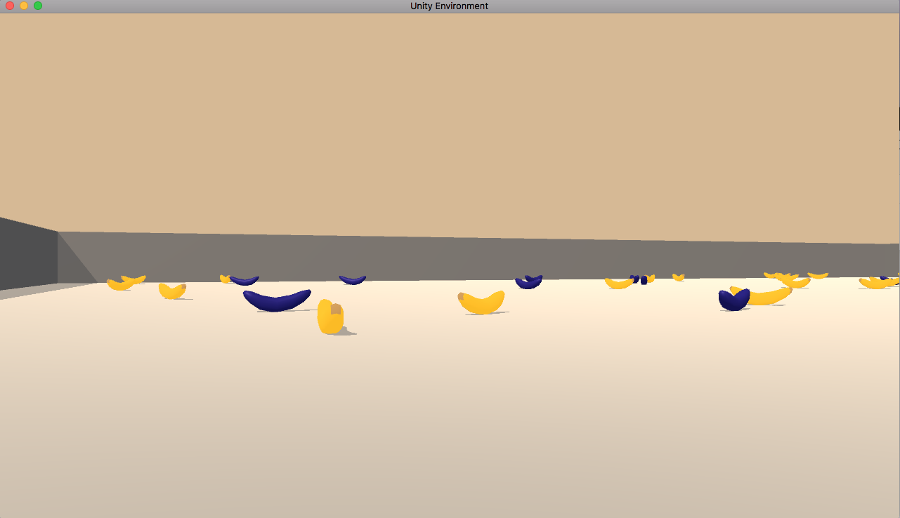

# Project 1: Navigation

## 1. Overview
In this project, I train an agent which efficiently collects yellow bananas spread
over a two-dimensional plane, while avoiding blue bananas.
For training, we use some deep reinforcement learning algorithms.
The repository for this project by Udacity is available
[here](https://github.com/udacity/deep-reinforcement-learning/tree/master/p1_navigation).

## 2. Environment
- **State**: The state space of the environment is **37**-dimensional. Each state
encodes the agent's velocity as well as ray-based perception of the objects located
around the forward direction of the agent.
- **Action**: The agent can take one of the **4** discrete actions at each time step:
`1`= move forward, `2`= move backward, `3`= turn left and `4`= turn right.
- **Reward**: At each time step, **+1** (resp. **-1**) reward is provided if the agent collects
a yellow (resp. blue) banana.

The task is episodic. I use the average score over the last 100 episodes
as a metric for measuring the performance of the trained agent. I call the environment
is solved when the average score becomes **13.0** or higher.

An example of the captured image from the simulator for this environment can be seen below:


## 3. Training Algorithm
For training models, I have implemented deep Q-learning algorithm as well as
deep double Q-learning algorithm. For storing and sampling experiences (experience =
a tuple of state, action, reward, next state and if the episode has ended or not)
for training, I have implemented the normal replay buffer as well as the prioritized
replay buffer. For further details, please refer to the report `Report.pdf`
and the references therein.

## 4. Contents of Repository
This repository contains the following files:
- `model_dqn.py`: This Python file contains the module `DNQ` defining the neural network
which determines the policy of the agent.
- `agent_dqn_prioritized.py`: This Python file defines the module `Agent` defining the deep
reinforcement learning agent and the module `ReplayBuffer` for the (prioritized)
replay buffer.
- `Navigation.ipynb`: By running the cells in Jupyter notebook, the deep reinforcement
learning agents are trained. The performance of the trained model can be checked with it.   
- `Navigation.html`: html export of `Navigation.ipynb`
- `Report.pdf`: This pdf file summarizes the algorithms used in this project and
performance of the trained agent.
- `weights/check_point_#_saved.pth` (`#`=1, 2, 3, 4): this file stores the weights of the neural network.
(`#`=1: deep Q-learning with standard replay buffer, `#`=2: deep double Q-learning with standard replay buffer, `#`=3: deep Q-learning with prioritized replay buffer, `#`=4: deep double Q-learning with prioritized replay buffer)
- `README.md`: This markdown file.
- `image`: this folder contains images used for this markdown as well as the
report `Report.pdf`.

On top of this, the simulator for the environment is available from the following links:
- [for Linux](https://s3-us-west-1.amazonaws.com/udacity-drlnd/P1/Banana/Banana_Linux.zip),
- [for Mac OSX](https://s3-us-west-1.amazonaws.com/udacity-drlnd/P1/Banana/Banana.app.zip),
- [for Windows (32-bit)](https://s3-us-west-1.amazonaws.com/udacity-drlnd/P1/Banana/Banana_Windows_x86.zip),
- [for Windows(64-bit)](https://s3-us-west-1.amazonaws.com/udacity-drlnd/P1/Banana/Banana_Windows_x86_64.zip).

Outside this repository, the performance of the trained agent (with deep
double deep Q-learning with prioritized replay buffer) can be watched at
[YouTube](https://youtu.be/SKi2kL9JTDs).

## 4. Setup and Dependencies
To play with the codes I provide, please setup the Python environment
by following the instruction by Udacity (see [here](https://github.com/udacity/deep-reinforcement-learning)
for further detail):

0. **Anaconda**: If Anaconda is not installed, install from the
[official website](https://www.anaconda.com/).
1. **Python Environment**: Create and activate a new Python environment with Python 3.6
  - For Linux or Mac
  ```
  conda create --name drlnd python=3.6
  source activate drlnd
  ```
  - For Windows  
  ```
  conda create --name drlnd python=3.6
  activate drlnd
  ```
2. **OpenAI Gym**: Follow the instruction of
[OpenAI Gym repository](https://github.com/openai/gym) to carry out
the minimum install of OpenAI Gym. Install
[**classic control**](https://github.com/openai/gym#classic-control)
and [**box2d environment**](https://github.com/openai/gym#box2d).
3. **Install Dependencies**
Clone the repository for Deep Reinforcement Learning Nanodegree by Udacity a
and install several dependencies as follows:
```
git clone https://github.com/udacity/deep-reinforcement-learning.git
cd deep-reinforcement-learning/python
pip install .
```
4. **IPython kernel** Create IPython kernel for this Python environment:
```
python -m ipykernel install --user --name drlnd --display-name "drlnd"
```
Choose kernel `drlnd` when one runs the Jupyter notebook `Navigation.ipynb`.

## 5. Instruction
To play, run the cells in `Navigation.ipynb`. This will automatically
start the simulator. The agents are trained and their performance
can be seen in the end. Performance of an agent (double deep Q-learning with
prioritized replay buffer) can be watched at [YouTube](https://youtu.be/SKi2kL9JTDs).
